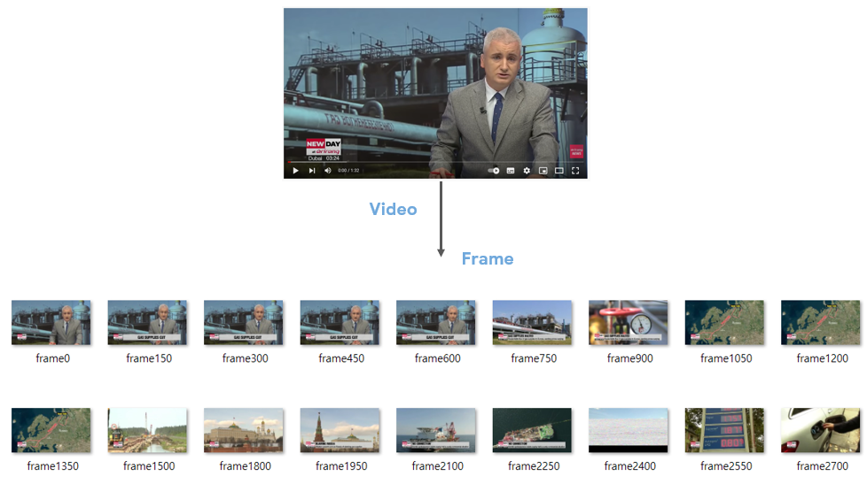
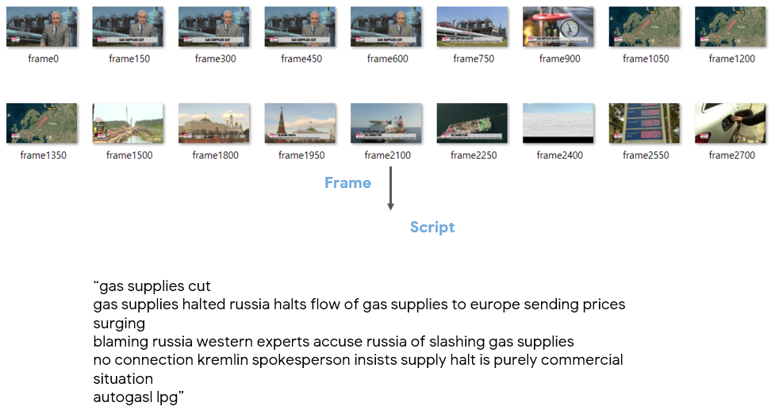
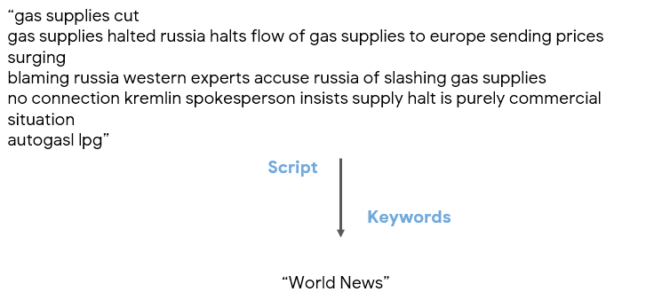
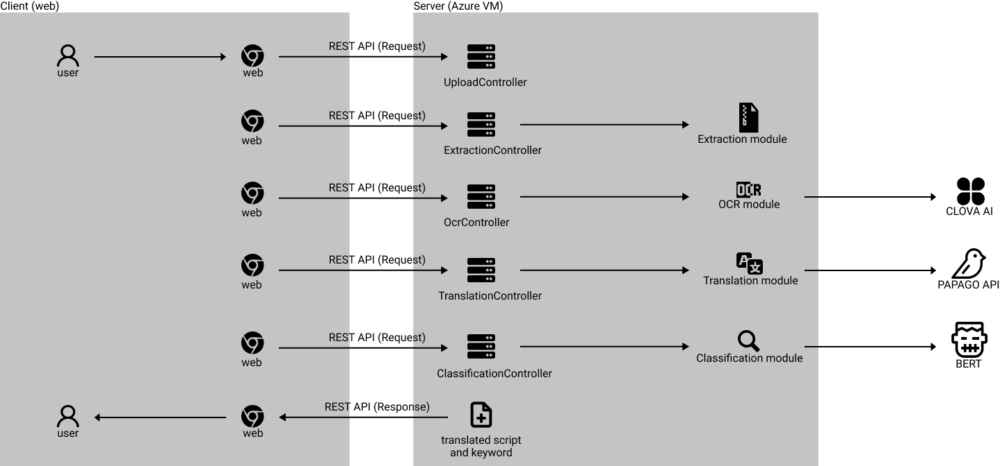
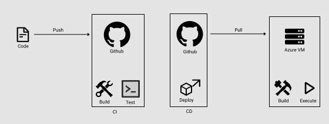
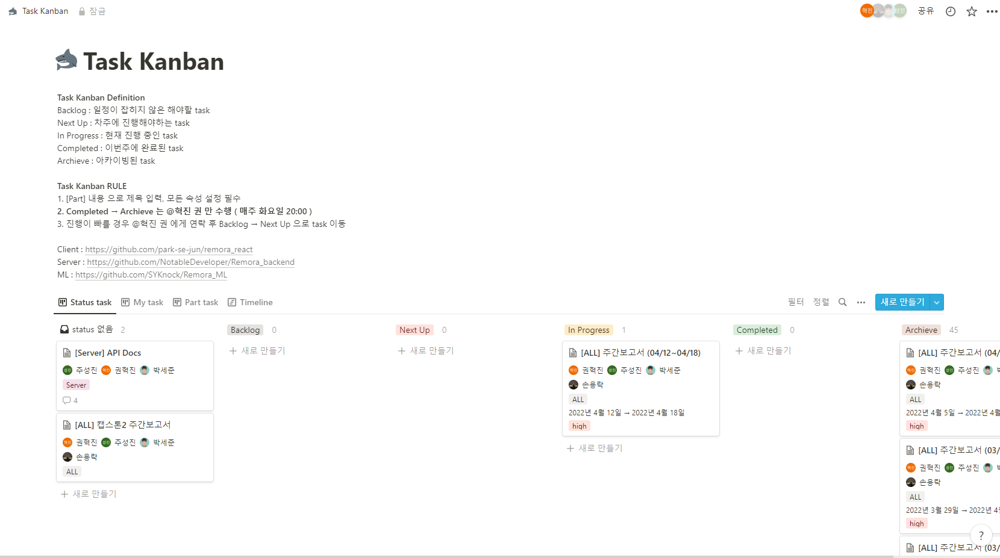

# Remora
Remora backend Repository

JAVA : openjdk 11.0.11  
gradle : 7.2

#### 개요
- 영상을 시청하지 않고 영상의 내용을 확인하고 싶어서 진행된 프로젝트입니다.
- OCR을 이용한 영상 속 텍스트 추출과 키워드 분류 프로그램입니다.
- 사용자가 input으로 영상을 전달하면 해당 영상에 포함된 텍스트를 추출하고 분석하여 키워드와 함께 스크립트 형태로 output을 제공합니다.

---
#### 프로젝트 기능
- 사용자가 input으로 전달한 영상의 프레임을 추출합니다.

- 해당 프레임 속에 존재하는 텍스트를 OCR Model을 사용해서 스크립트 형태로 추출합니다.

- 추출된 스크립트에 Classification Model을 사용해서 영상에 적절한 키워드를 생성합니다.

---
#### 프로젝트 구조

- 시스템 흐름
    1. 사용자로부터 입력받은 영상으로 클라이언트는 서버에 요청을 전송합니다.
    2. 서버는 해당 영상의 프레임을 추출하고 추출된 프레임으로 OCR 모듈을 호출합니다.
    3. 사용자가 번역을 원할 경우 OCR 모듈의 결과 텍스트를 기반으로 번역 모듈을 호출합니다.
    4. 결과 텍스트를 기반으로 키워드를 추출합니다.
    5. 모든 결과물을 클라이언트에게 응답으로 전송합니다.
- CI/CD
  1. GitHub에 코드를 push합니다.
  2. GitHub Action을 이용해 코드를 build하고 test합니다.
  3. 위의 과정이 성공했다면 배포를 시작합니다.
  4. 서버에 접속하고 코드를 pull 받습니다.
  5. jar 파일을 생성하고 실행합니다.

---
#### 프로젝트 관리

- 노션에 task kanban을 구성하여 프로젝트를 관리합니다.
    - 파트별, 담당자별로 관리하고 timeline을 통해 진행사항과 마감일을 관리합니다.
- 매주 화요일마다 짧은 회의를 통해 task를 점검하고 관리합니다.

---
#### 프로젝트 데모
[Demo Video](https://user-images.githubusercontent.com/26922000/164188298-1e914afb-d5d0-4eee-9756-426da0e99fd6.mp4)

---
#### 기타
- 논문 작성 중
